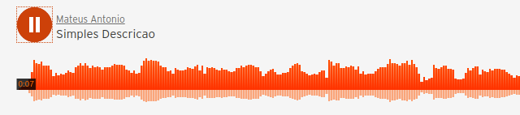
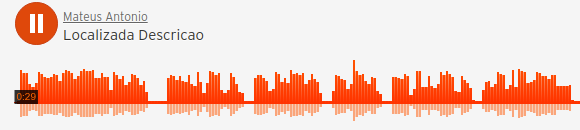

<figure class="image" align='center'>
    
    <figcaption></figcaption>
</figure>

# Índice
+ [Sobre](#sobre)
    - [Passo 1: Identificação dos objetos]()
+ [Primeiros Passos](#steps)
+ [Uso](#uso)

<h1 id="sobre">Sobre</h1>

O *Detect My Scene* foi um projeto realizado durante a live coding do <a href="">meu canal na Twitch</a>. O objetivo principal era realizar algum projeto assistivo, para suprir alguma necessidade. Através de discussões foi resolvido que poderíamos ajudar deficientes visuais, criando um programa que fosse capaz de descrever uma foto (que poderia ser extendido para vídeos também) através de texto ou áudio. Com isso o deficiente visual poderia tirar fotos em um ambiente ou até tirar fotos de alguma notícia ou artigo para rodar no software e ter uma breve descrição do que existe ali.

Para a criação dessa aplicação foram utilizados alguns conceitos de Inteligência Artificial e Processamento Digital de Imagens, com a biblioteca <a href="https://github.com/OlafenwaMoses/ImageAI">ImageAI</a> e alguns cálculos e aplicações implementadas do zero. O projeto é realizado em alguns passos.

Para a maioria dos testes durante o desenvolvimento do projeto, a imagem a seguir foi utilizada, além de algumas outras para validações. Os objetos identificados nas imagens testadas no desenvolvimento mostram apenas objetos que o algoritmo tem 45% ou mais de certeza de ser de fato aquilo que foi identificado.

<figure class="image" align='center'>
    
    <figcaption>Figura 1. Imagem de teste</figcaption>
</figure>

    
</a>

Figura 1. Imagem de teste

<h3><b>Passo 1: Identificação dos objetos</b></h3>

Esse passo é realizado pela própria biblioteca utilizada (ImageAI), onde são identificados todos os objetos reconhecidos na imagem, informando o nome, probabilidade de ser aquele objeto específico e suas delimitações na imagem. Essas informações base são essenciais para os próximos passos, pois são com elas que todas as informações são cruzadas e geram novos resultados.

<figure class="image" align='center'>
     delimitação, conhecida como *box_points*. Determinar esse ponto foi necessário para que cada objeto tivesse sua posição em um ponto (x, y) na imagem, para que o próximo passo pudesse ser feito.

<figure class="image" align='center'>
    
    <figcaption>Figura 3. Determinação do ponto (x, y) de cada objeto</figcaption>
</figure>

<h2><b>Passo 3: </b></h2>

Com os objetos tendo suas posições devidamente identificadas, foi possível implementar e calcular a *distância euclidiana* entre cada um dos objetos identificados. Além de saber exatamente em que área da imagem cada objeto está, agora sabemos a distância entre cada um. Isso possibilita a implementação de outros algoritmos como KNN (Vizinho mais próximo), entre outros, a fim de criar uma relação entre os objetos e criar descrições para o/a deficiente visual cada vez mais detalhadas.

<figure class="image" align='center'>
    
    <figcaption>Figura 3. Cálculo de distância entre objetos</figcaption>
</figure>

Além disso foi criada uma Matriz de Distância, com identificador entre cada objeto (como pode ser visto na imagem acima) e linhas indicando onde inicia e para. A tabela com os valores para a imagem de exemplo podem ser vistos abaixo (distância em pixels).

<table align='center'>
<thead>
<tr>
<th style="text-align:center">*</th>
<th style="text-align:center"><strong>0</strong></th>
<th style="text-align:center"><strong>1</strong></th>
<th style="text-align:center"><strong>2</strong></th>
<th style="text-align:center"><strong>3</strong></th>
<th style="text-align:center"><strong>4</strong></th>
<th style="text-align:center"><strong>5</strong></th>
<th style="text-align:center"><strong>6</strong></th>
<th style="text-align:center"><strong>7</strong></th>
</tr>
</thead>
<tbody>
<tr>
<td style="text-align:center"><strong>0</strong></td>
<td style="text-align:center">0</td>
<td style="text-align:center">132</td>
<td style="text-align:center">71</td>
<td style="text-align:center">452</td>
<td style="text-align:center">188</td>
<td style="text-align:center">203</td>
<td style="text-align:center">190</td>
<td style="text-align:center">296</td>
</tr>
<tr>
<td style="text-align:center"><strong>1</strong></td>
<td style="text-align:center">132</td>
<td style="text-align:center">0</td>
<td style="text-align:center">63</td>
<td style="text-align:center">584</td>
<td style="text-align:center">318</td>
<td style="text-align:center">282</td>
<td style="text-align:center">321</td>
<td style="text-align:center">426</td>
</tr>
<tr>
<td style="text-align:center"><strong>2</strong></td>
<td style="text-align:center">71</td>
<td style="text-align:center">63</td>
<td style="text-align:center">0</td>
<td style="text-align:center">521</td>
<td style="text-align:center">259</td>
<td style="text-align:center">249</td>
<td style="text-align:center">261</td>
<td style="text-align:center">367</td>
</tr>
<tr>
<td style="text-align:center"><strong>3</strong></td>
<td style="text-align:center">452</td>
<td style="text-align:center">584</td>
<td style="text-align:center">521</td>
<td style="text-align:center">0</td>
<td style="text-align:center">282</td>
<td style="text-align:center">433</td>
<td style="text-align:center">269</td>
<td style="text-align:center">193</td>
</tr>
<tr>
<td style="text-align:center"><strong>4</strong></td>
<td style="text-align:center">188</td>
<td style="text-align:center">318</td>
<td style="text-align:center">259</td>
<td style="text-align:center">282</td>
<td style="text-align:center">0</td>
<td style="text-align:center">171</td>
<td style="text-align:center">25</td>
<td style="text-align:center">108</td>
</tr>
<tr>
<td style="text-align:center"><strong>5</strong></td>
<td style="text-align:center">203</td>
<td style="text-align:center">282</td>
<td style="text-align:center">249</td>
<td style="text-align:center">433</td>
<td style="text-align:center">171</td>
<td style="text-align:center">0</td>
<td style="text-align:center">195</td>
<td style="text-align:center">240</td>
</tr>
<tr>
<td style="text-align:center"><strong>6</strong></td>
<td style="text-align:center">190</td>
<td style="text-align:center">321</td>
<td style="text-align:center">261</td>
<td style="text-align:center">269</td>
<td style="text-align:center">25</td>
<td style="text-align:center">195</td>
<td style="text-align:center">0</td>
<td style="text-align:center">109</td>
</tr>
<tr>
<td style="text-align:center"><strong>7</strong></td>
<td style="text-align:center">296</td>
<td style="text-align:center">426</td>
<td style="text-align:center">367</td>
<td style="text-align:center">193</td>
<td style="text-align:center">108</td>
<td style="text-align:center">240</td>
<td style="text-align:center">109</td>
<td style="text-align:center">0</td>
</tr>
</tbody>
</table>

Tabela 1. Matriz de distância entre os objetos da imagem

<h2><b>Passo 4: </b></h2>

De acordo com o que foi feito no *passo 1* já é possível criar uma descrição textual do que pode ser encontrado na imagem e uma sonora também. Todos os tipos de objetos identificáveis pelo modelo foram traduzidos para que um dos principais diferenciais do projeto pudesse ser feito: descrição textual e sonora em português. A seguir é possível escutar o áudio gerado automaticamente depois da identificação dos objetos:

Audio 1. Descrição simples da cena

<h2><b>Passo 5: </b></h2>

A partir do passo 2 é possível melhorar a descrição textual e sonora. Por isso foram criados dois tipos de descrição, uma simples (descrição anterior) e outra mais detalhada a respeito da licalização dos objetos. A descrição um pouco mais detalhada pode ser vista a seguir:

Audio 2. Descrição com localização na cena

<h2><b>Próximos passos</b></h2>

A partir do passo 3, com a criação da matriz de distância seria possível, através da identificação do objeto e a distância entre eles, estimar a distância entre cada um em métricas reais (metro) e a distância do objeto até o observador. Com isso seria possível criar uma descrição complexa e detalhada para o deficiente visual, entretanto não seria viável implementar isso durante as lives, visto que iria demandar muito tempo e ainda há muito o que aprender por aí em outros projetos!

<h1 id="steps">2. Primeiros Passos</h1> 

Siga estas instruções para rodar o projeto na sua máquina. 

## Pré-requisitos

> - Python 3.7.x
> - Máquina com GPU

## Instalação

Com o python `3.7.x` instalado, basta instalar com o gerenciador de pacotes do python o pipenv:

`pip3 install pipenv`

Clone o repositório para obter o código necessário:

`git clone https://github.com/mateustoin/DetectMyScene`

O arquivo de modelos utilizado para a identificações do projeto é o `resnet50_coco_best_v2.0.1.h5`, pode ser encontrado o link de download na <a href="https://github.com/OlafenwaMoses/ImageAI">documentação do ImageAI</a>. Cole ele na pasta raiz do projeto. Depois todas as dependências necessárias para a execução do projeto podem ser instaladas automaticamente com o comando:

`pipenv install`

<h1 id='uso'>3. Uso</h1>

Para utilizar o projeto, basta entrar no ambiente criado pelo pipenv.

`pipenv shell`

Depois que estiver rodando dentro do ambiente virtual, a execução do código é realizada através de uma simples API para facilitar a entrada de dados. Pode ser iniciada com:

`uvicorn main:app`

Um servidor se iniciará em `127.0.0.1:500`. 

<figure class="image" align='center'>
    
    <figcaption>Figura 4. Entrada de imagens na API</figcaption>
</figure>

Escolha uma imagem e clique em *Enviar*. Após o processamento será retornado as descrições textuais como corpo da resposta e os áudios serão gerados na mesma pasta do projeto.

<figure class="image" align='center'>
    
    <figcaption>Figura 5. Resultado do processamento</figcaption>
</figure>